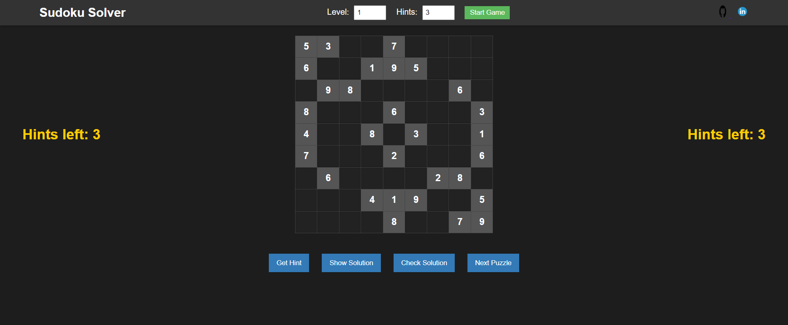

# Sudoku Solver

A web-based Sudoku game where users can solve Sudoku puzzles, get hints, and check their solutions. The game allows for different difficulty levels and customizable hint counts. It features a modern, dark-themed design and intuitive controls, including keyboard navigation.

## Features

- Different levels of Sudoku puzzles (easy and medium).
- Ability to get hints.
- Function to check the correctness of the solution.
- Option to view the solution.
- Next puzzle functionality.
- Keyboard navigation using arrow keys.
- Stylish dark-themed design.

## Demo



## Installation

1. Clone the repository:

   ```sh
   git clone https://github.com/yourusername/sudoku-solver.git
   cd sudoku-solver
